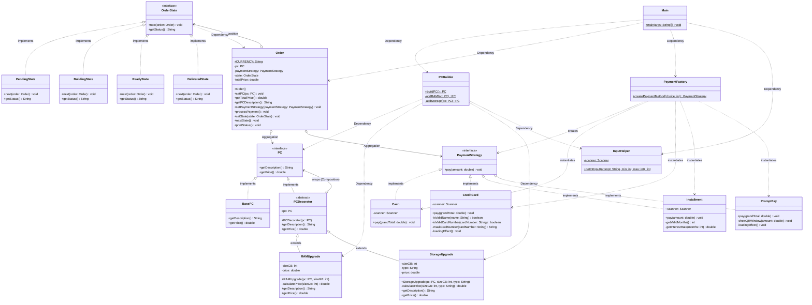

```mermaid

classDiagram
    %% --------------------------------------------------------
    %% Decorator Pattern: PC Hardware Components
    %% --------------------------------------------------------
    class PC {
        <<interface>>
        +getDescription() String
        +getPrice() double
    }

    class BasePC {
        +getDescription() String
        +getPrice() double
    }

    class PCDecorator {
        <<abstract>>
        #pc: PC
        +PCDecorator(pc: PC)
        +getDescription() String
        +getPrice() double
    }

    class RAMUpgrade {
        -sizeGB: int
        -price: double
        +RAMUpgrade(pc: PC, sizeGB: int)
        -calculatePrice(sizeGB: int) double
        +getDescription() String
        +getPrice() double
    }

    class StorageUpgrade {
        -sizeGB: int
        -type: String
        -price: double
        +StorageUpgrade(pc: PC, sizeGB: int, type: String)
        -calculatePrice(sizeGB: int, type: String) double
        +getDescription() String
        +getPrice() double
    }

    PC <|.. BasePC : implements
    PC <|.. PCDecorator : implements
    PCDecorator o--> PC : wraps (Composition)
    PCDecorator <|-- RAMUpgrade : extends
    PCDecorator <|-- StorageUpgrade : extends

    %% --------------------------------------------------------
    %% Strategy Pattern: Payment Methods
    %% --------------------------------------------------------
    class PaymentStrategy {
        <<interface>>
        +pay(amount: double) void
    }

    class Cash {
        -scanner: Scanner
        +pay(grandTotal: double) void
    }

    class CreditCard {
        -scanner: Scanner
        +pay(grandTotal: double) void
        -isValidName(name: String) boolean
        -isValidCardNumber(cardNumber: String) boolean
        -maskCardNumber(cardNumber: String) String
        -loadingEffect() void
    }

    class Installment {
        ~scanner: Scanner
        +pay(amount: double) void
        -getValidMonths() int
        -getInterestRate(months: int) double
    }

    class PromptPay {
        +pay(grandTotal: double) void
        -showQRWindow(amount: double) void
        -loadingEffect() void
    }

    PaymentStrategy <|.. Cash : implements
    PaymentStrategy <|.. CreditCard : implements
    PaymentStrategy <|.. Installment : implements
    PaymentStrategy <|.. PromptPay : implements

    %% --------------------------------------------------------
    %% Factory Pattern: Payment Method Creation
    %% --------------------------------------------------------
    class PaymentFactory {
        +createPaymentMethod(choice: int) PaymentStrategy$
    }

    PaymentFactory ..> PaymentStrategy : creates
    PaymentFactory ..> Cash : instantiates
    PaymentFactory ..> CreditCard : instantiates
    PaymentFactory ..> Installment : instantiates
    PaymentFactory ..> PromptPay : instantiates

    %% --------------------------------------------------------
    %% State Pattern: Order Tracking
    %% --------------------------------------------------------
    class OrderState {
        <<interface>>
        +next(order: Order) void
        +getStatus() String
    }

    class PendingState {
        +next(order: Order) void
        +getStatus() String
    }

    class BuildingState {
        +next(order: Order) void
        +getStatus() String
    }

    class ReadyState {
        +next(order: Order) void
        +getStatus() String
    }

    class DeliveredState {
        +next(order: Order) void
        +getStatus() String
    }

    OrderState <|.. PendingState : implements
    OrderState <|.. BuildingState : implements
    OrderState <|.. ReadyState : implements
    OrderState <|.. DeliveredState : implements

    %% --------------------------------------------------------
    %% Core Architecture & Utilities
    %% --------------------------------------------------------
    class Order {
        +CURRENCY: String$
        -pc: PC
        -paymentStrategy: PaymentStrategy
        -state: OrderState
        -totalPrice: double
        +Order()
        +setPC(pc: PC) void
        +getTotalPrice() double
        +getPCDescription() String
        +setPaymentStrategy(paymentStrategy: PaymentStrategy) void
        +processPayment() void
        +setState(state: OrderState) void
        +nextState() void
        +printStatus() void
    }

    class PCBuilder {
        +buildPC() PC$
        -addRAM(pc: PC) PC$
        -addStorage(pc: PC) PC$
    }

    class InputHelper {
        -scanner: Scanner$
        +getIntInput(prompt: String, min: int, max: int) int$
    }

    class Main {
        +main(args: String[]) void$
    }

    %% --------------------------------------------------------
    %% Inter-System Relationships
    %% --------------------------------------------------------
    Order o--> PC : Aggregation
    Order o--> PaymentStrategy : Aggregation
    Order o--> OrderState : Composition
    
    OrderState ..> Order : Dependency
    
    Main ..> PCBuilder : Dependency
    Main ..> Order : Dependency
    Main ..> PaymentFactory : Dependency
    Main ..> InputHelper : Dependency
    
    PCBuilder ..> PC : Dependency
    PCBuilder ..> RAMUpgrade : Dependency
    PCBuilder ..> StorageUpgrade : Dependency
    PCBuilder ..> InputHelper : Dependency

```
